# Project (COMP-SCI 5567): Video Object Tracking

Deep Learning Project — Video Object Tracking

**Related:** [RCNN.md](RCNN.md) — the lecture deck covering the R-CNN family
(R-CNN → Fast R-CNN → Faster R-CNN → Mask R-CNN) and YOLO.

---

## Project Overview

COMP-SCI 5567 – 0001 course project requirements include two sections: midterm and final requirements. The aim of this project is to let you better understand the application of deep learning models on wider applications. Please go through the video for the details of this project. For any questions, please contact: problemsolvingxx@gmail.com

In this project, you are expected to use Google colab for the coding. For example codes, please refer to the slides.

---

## Content

- Basic Concepts in Multi-Object Tracking & Segmentation (MOTS)
- Assignment Overview
- Data Preparation / Augmentation
- Object Detection
- Tracker / Similarity Model Training
- Evaluation & Submission

---

## Demo

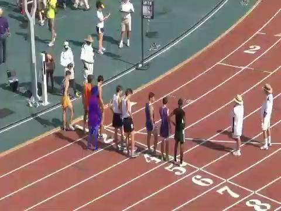

---

## MOTS Application

- **Autonomous driving**: Tracking pedestrians, vehicles, and obstacles
- **Sports analytics**: Following players and ball movement
- **Surveillance systems**: Monitoring people and objects in security footage
- **Robotics**: Tracking objects for manipulation or navigation
- **Retail analytics**: Tracking customer movement in stores
- **Wildlife monitoring**: Following animal movements in their habitats
- **Traffic management**: Monitoring vehicle flow and pedestrian movement

---

## Online vs offline tracking

**Online tracking**

Processes two frames at a time

For real-time applications

Hard to recover from errors or occlusions

**Offline tracking**

Processes a batch of frames

Good to recover from occlusions (short ones as we will see)

Not suitable for real-time applications

Suitable for video analysis

---

## Off-line Tracking

- Detect objects across frames in a video
- Create a gallery for Re-ID
- Identify a single object and assign it with the same id across frames
- Output frames with bounding boxes, alongside the id

---

## Assignment Overview

Goal:

Parse and prepare data.

Tune the pre-trained model using the training data. (4-6G VRAM, colab)

Implement the tracker and use it with the model.

Generate videos with boxes and ids for testing videos.

---

## Data Preparation

Training dataset (MOTS):

```
1,3,586,447,85,263,1,1,1
```

Which means:

(https://github.com/khalidw/MOT16_Annotator)

```
time frame 1
object id 3
bb_left 586
bb_top 447
bb_width 85
bb_height 263
```

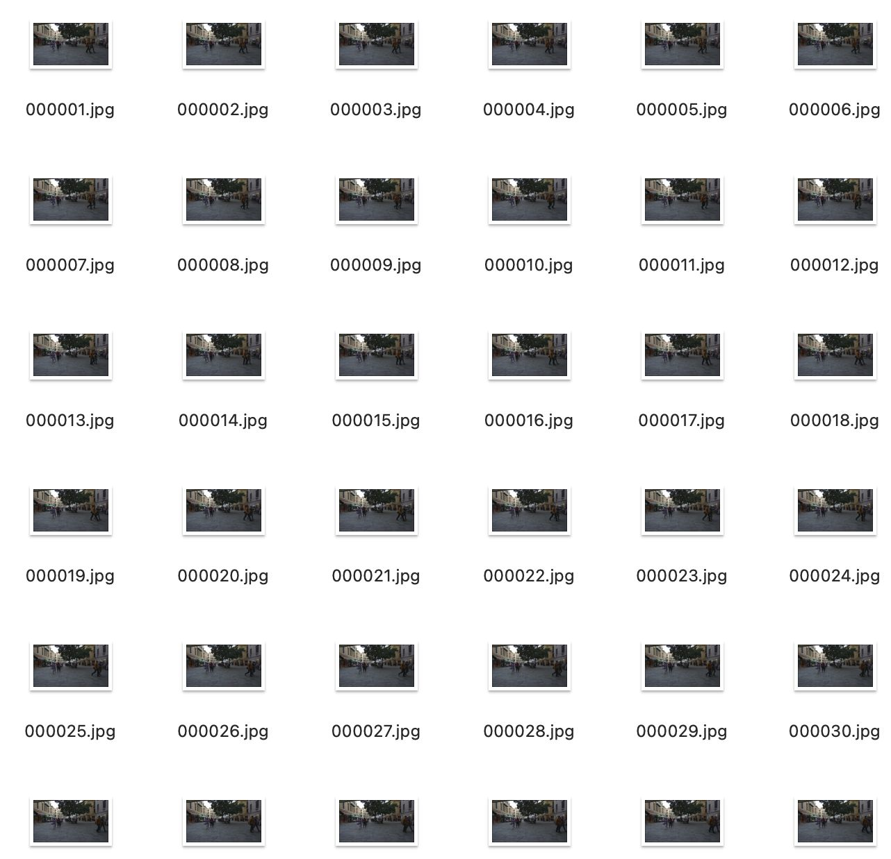

Parse the ground truth:

```python
import numpy as np
def parse_gt_file (file_path):
   data = []
   with open(file_path, 'r') as f:
       pass # do the preprocessing here
   return data
```

---

## Data Augmentation

- Data augmentation is the process of artificially generating new data from existing data, primarily to train new machine learning (ML) models.
- Data augmentation artificially increases the dataset by making small changes to the original data.

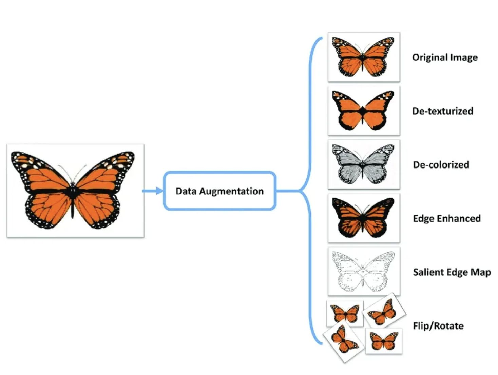

```python
from torchvision import transforms
color_aug = transforms.Compose([
   transforms.ColorJitter(brightness=0.5, contrast=0.5, saturation=0.5),
   transforms.GaussianBlur(kernel_size=(5, 9), sigma=(0.1, 5)),
])
augmented_image  = color_aug(original_image)
```

---

## Object Detection Models

Since it requires enormous training data and computational resources to fully train a model from scratch to perform well on MOTS task, in this assignment, you are highly encouraged to load pre-trained models from torchvision and fine-tune it on the provided training dataset.

- **Fast R-CNN / Faster R-CNN**: Used for object detection (bounding box regression and classification)
- **Mask R-CNN**: Used for instance segmentation (pixel-wise mask prediction)

_The distinction between detection and instance segmentation is laid out in
[Computer Vision Task](RCNN.md#computer-vision-task); full background on every model named
here is in [RCNN.md](RCNN.md)._

---

## R-CNN

_See also in RCNN.md: [R-CNN Architecture](RCNN.md#r-cnn-architecture),
[R-CNN](RCNN.md#r-cnn), [Region Proposals – Selective Search](RCNN.md#region-proposals--selective-search),
[R-CNN Training](RCNN.md#r-cnn-training), [Bounding-Box Regression](RCNN.md#bounding-box-regression),
and [Problems of R-CNN](RCNN.md#problems-of-r-cnn)._

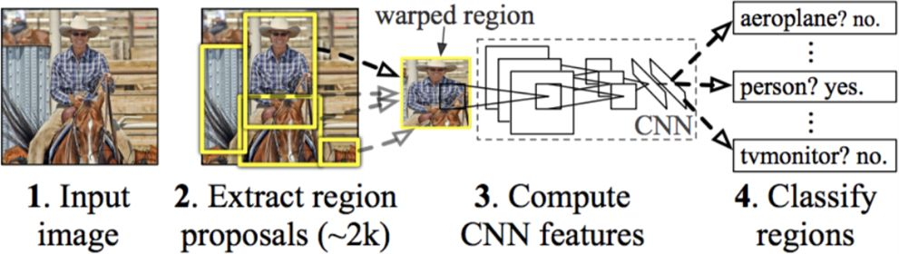

Girschick et al, "Rich feature hierarchies for accurate object detection and semantic segmentation", CVPR 2014

> **Note.** The author's name is spelled "Girschick" in the source deck. The correct
> spelling is Girshick (Ross Girshick), as used in [RCNN.md](RCNN.md#r-cnn).

---

## SPP-net

_See also in RCNN.md: [R-CNN vs SPP-net vs Fast R-CNN](RCNN.md#r-cnn-vs-spp-net-vs-fast-r-cnn)
for the timing comparison, and [RoI Pooling](RCNN.md#roi-pooling-1), which describes RoI
pooling as "a special case of the SPP layer with one pyramid level"._

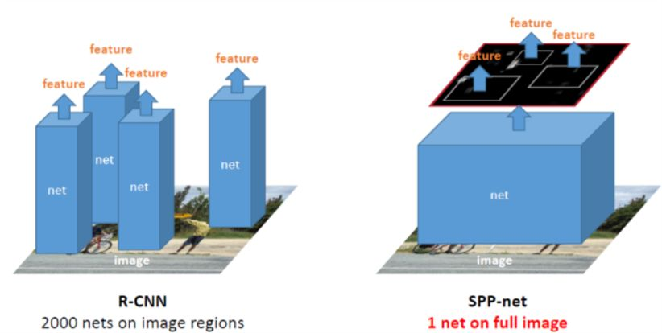

He et al. Spatial Pyramid Pooling in Deep Convolutional Networks for Visual Recognition. ECCV 2014.

---

## Fast R-CNN

_See also in RCNN.md: [Fast R-CNN](RCNN.md#fast-r-cnn),
[Fast R-CNN Architecture](RCNN.md#fast-r-cnn-architecture), [RoI Pooling](RCNN.md#roi-pooling),
[Training & Testing](RCNN.md#training--testing) for the loss function, and
[Problems of Fast R-CNN](RCNN.md#problems-of-fast-r-cnn)._

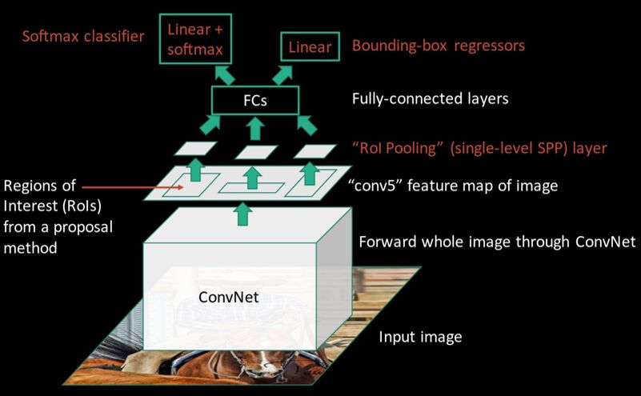

---

## Faster R-CNN

- Have the proposal generation integrated with the rest of the pipeline
- Region Proposal Network (RPN) trained to produce region proposals directly.

_See also in RCNN.md: [Faster R-CNN(RPN + Fast R-CNN)](RCNN.md#faster-r-cnnrpn--fast-r-cnn),
[Training Goal : Share Features](RCNN.md#training-goal--share-features),
[RPN](RCNN.md#rpn), [RPN(Fully Convolutional Network)](RCNN.md#rpnfully-convolutional-network),
[Anchors as references](RCNN.md#anchors-as-references),
[Positive/Negative Samples](RCNN.md#positivenegative-samples), and
[RPN Loss Function](RCNN.md#rpn-loss-function)._

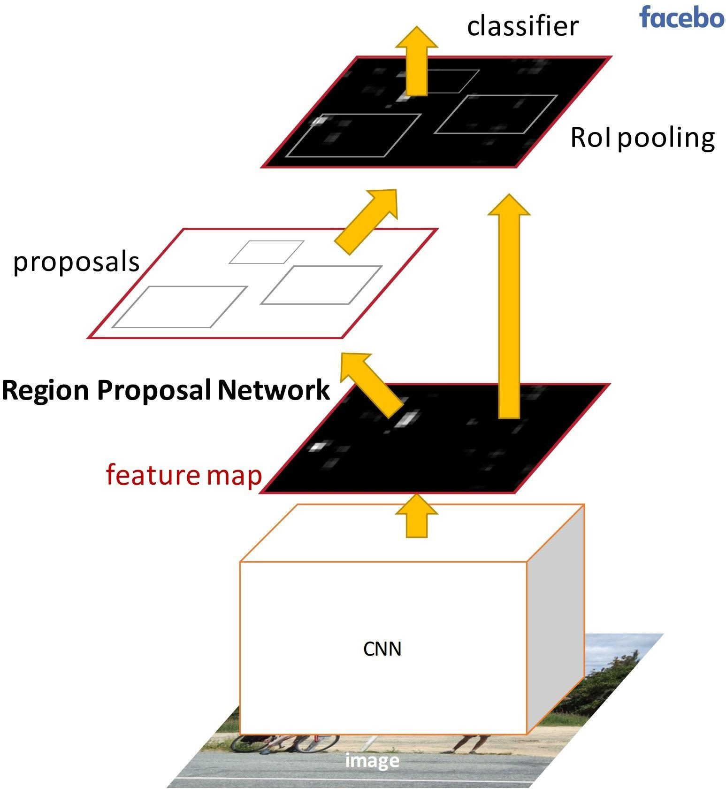

Ren et al, "Faster R-CNN: Towards Real-Time Object Detection with Region Proposal Networks", NIPS 2015

---

## Comparison

_See also in RCNN.md: [R-CNN vs SPP-net vs Fast R-CNN](RCNN.md#r-cnn-vs-spp-net-vs-fast-r-cnn)
for training and test times, [Is Faster R-CNN Really Fast?](RCNN.md#is-faster-r-cnn-really-fast)
for the speed/accuracy trade-off, and [Results – MS COCO](RCNN.md#results--ms-coco)._

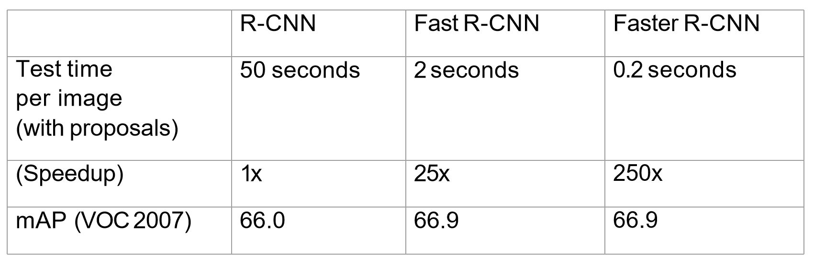

---

## Mask R-CNN (optional, pixel-level seg)

_See also in RCNN.md: [Mask R-CNN](RCNN.md#mask-r-cnn) and [its head architectures](RCNN.md#mask-r-cnn-1),
[Loss Function, Mask Branch](RCNN.md#loss-function-mask-branch), plus
[Is It Enough?](RCNN.md#is-it-enough) and [RoI Align](RCNN.md#roi-align) on the quantization
problem that RoI Align fixes._

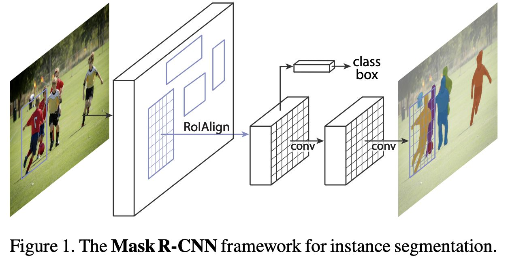

---

## Faster R-CNN

Since we will have limited amount of data to fully train a model from scratch, it's a good approach to do few-shot fine-tuning which is a form of transfer learning.

- Transfer learning is a machine learning technique in which knowledge gained through one task or dataset is used to improve model performance on another related task and/or different dataset.
- Few-shot fine-tuning is to only tune a small portion of overall parameters in a large model.
- Together with the data augmentation, we can simply tune a pre-trained model on our own small training dataset.

_The model being fine-tuned is described in
[Faster R-CNN(RPN + Fast R-CNN)](RCNN.md#faster-r-cnnrpn--fast-r-cnn)._

---

## Fine-tune a pre-trained Faster R-CNN

```python
import torchvision
from torchvision.models.detection  import fasterrcnn_resnet50_fpn
from torchvision.models.detection.faster_rcnn  import FastRCNNPredictor

# Freeze backbone layers
for param in model.backbone.parameters():
   param.requires_grad = False

# Only fine-tune the heads for classification and mask prediction
params_to_optimize  = [p for p in model.parameters() if p.requires_grad]
```

_Freezing the backbone leaves the RPN and the detection heads trainable — see
[RPN](RCNN.md#rpn) and [Training & Testing](RCNN.md#training--testing) in RCNN.md for what
those heads predict and the losses they are trained against._

---

## Re-ID

Basic idea: train a model to identify all detected objects.

Cons: We have to fine-tune the model once new objects join or detected object leave

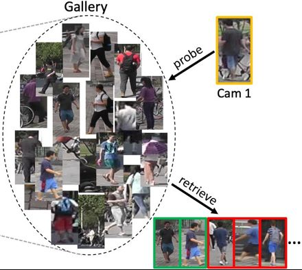

---

## Tracker (Re-ID)

We do not need to identify any face, our model is trained to just tell the difference between them

Otherwise, we have to fine-tune the model frequently whenever there is new one here

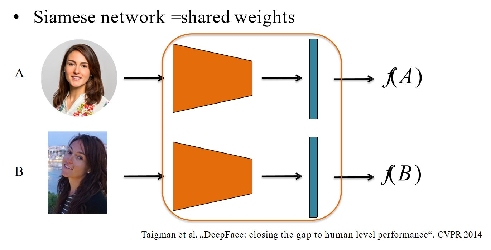

---

## Tracker (Similarity Model)

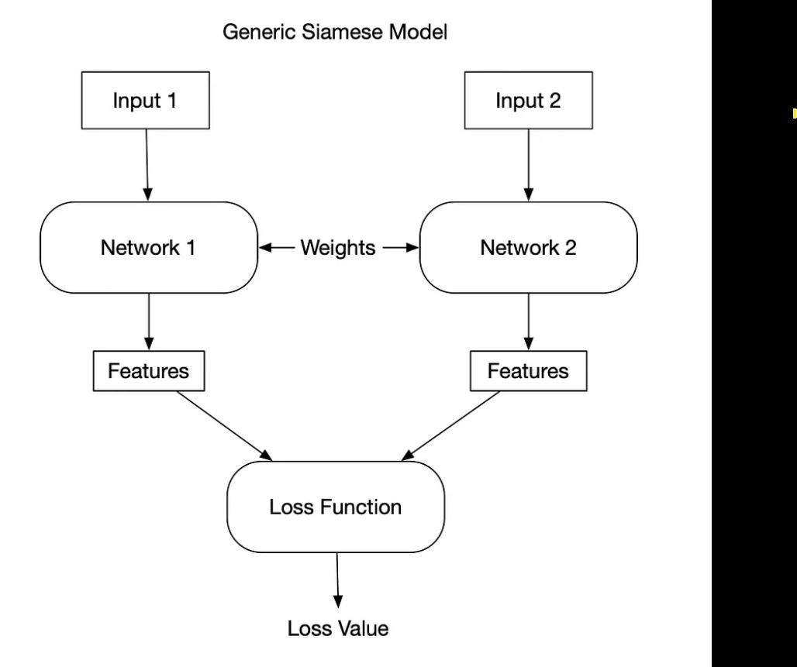


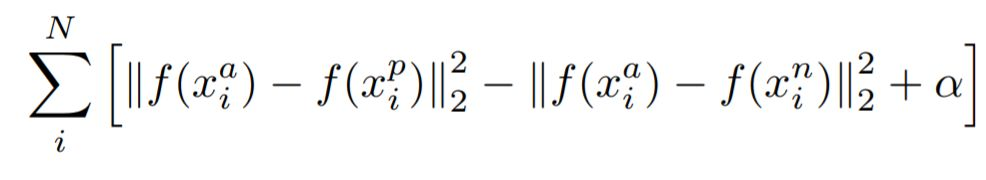

```python
import torch
import torch.nn as nn
import torch.nn.functional as F

class Siamese_Network(nn.Module):
    def __init__(self):
        super(Siamese_Network, self).__init__()

        # CNN layers for feature extraction
        self.conv1 = nn.Conv2d(1, 64, kernel_size=3)
        self.conv2 = nn.Conv2d(64, 128, kernel_size=3)
        self.conv3 = nn.Conv2d(128, 128, kernel_size=3)
        self.fc1 = nn.Linear(128 * 22 * 22, 256)
        self.fc2 = nn.Linear(256, 256)

    def forward_one(self, x):
        x = F.relu(F.max_pool2d(self.conv1(x), 2))
        x = F.relu(F.max_pool2d(self.conv2(x), 2))
        x = F.relu(self.conv3(x))
        x = x.view(-1, 128 * 22 * 22)
        x = F.relu(self.fc1(x))
        x = self.fc2(x)
        return x

    def forward(self, input1, input2):
        output1 = self.forward_one(input1)
        output2 = self.forward_one(input2)
        return output1, output2
```

> **Note — input size.** `fc1 = nn.Linear(128 * 22 * 22, 256)` fixes the flattened feature
> map at 22x22, which requires an input of roughly 102x102. Tracing the forward pass:
> conv1 (3x3) then maxpool 2 , conv2 (3x3) then maxpool 2, conv3 (3x3), so
> `((N - 2)/2 - 2)/2 - 2 = 22` gives `N = 102`. The 16x16 and 24x24 sizes named under
> Implementation Guidance below would collapse the feature map before conv3 and raise a
> shape error. Either the layer sizing or the stated crop sizes needs to change.
>
> **Note — channels.** `nn.Conv2d(1, 64, kernel_size=3)` expects 1 input channel
> (grayscale), while the Market-1501 and MOT16 pedestrian crops shown alongside it are
> RGB (3 channels). Either convert crops to grayscale or set the first conv to 3 channels.

Market-1501 Dataset

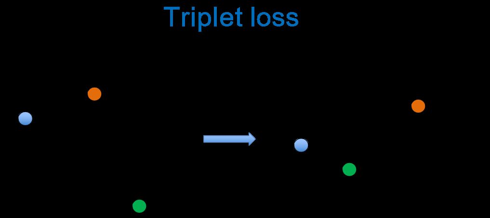

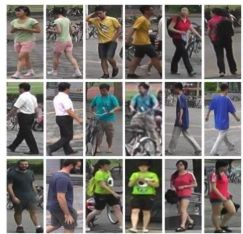

---

## Implementation Pipeline

Data processing(decode gt (rle)) & Data augmentation

Faster R-CNN few-shot fine-tuning

Train the Siamese Network for Re-ID

Perform Detection and Re-ID for tracking

**Faster R-CNN**

Object Detection and bounding box segmentation

**Re-ID**

Tracking objects across frames

---

## Implementation Guidance

This page is for guiding students who have even no idea about the implementation

Train the similarity network (input: raw images 16 \* 16) -> output: 0, 1

Fine-tune the Faster RCNN (input: raw images) -> output: bbox of each object, class id ..

Inference of similarity network (24 \* 24 images + gt) -> (1 , 0)

Get the bbox position from RCNN, retrieve images (30 \* 16) (representing single object)

Resize the retrieved image for each object as the size of the image that you use to train the similarity network

> **Note — crop sizes disagree.** This page names three different sizes: the similarity
> network is trained on `16 * 16`, inference is described on `24 * 24`, and retrieved
> crops are `30 * 16`. The closing line reconciles training against retrieval (resize
> retrieved crops to the training size), but training at 16x16 and inference at 24x24
> still conflict — a network with fully-connected layers cannot take both. None of the
> three matches the ~102x102 implied by the `Siamese_Network` code above.

---

## Midterm Requirements

The requirements for the midterm are listed as follows:

1. 15mins presentation for each group (Group 1-4 on Tuesday and Group 5-8 on Thursday). The topic should cover each group members' workload, timeline, current process and understanding on the methods. In the midterm presentation, you should be familiar with the aim of the project, models, and try to play around with the codes.

---

## Final Requirements

**I.** A final presentation for each group (Time TBD)

Present your design, implementation details, challenges encountered and a result video in class.

Rubric:

- **A**: Perfect tracking and bounding box across frames without missing the target.
- **B**: Can track an object across a majority of frames but not all.
- **C**: At least can detect the targeted object and assign a bounding box to it across some frames.

**II.** The submission requirements for the final are listed as follows:

1. All your source code (do not include any model weights since they are usually too big in size for canvas).
2. A tracking video of at least one single target pedestrian on one MOT16 test data (video or online link).
3. A pdf report (no less than 4 pages, letter, font size <=11) that contains the following sections (recommend using Latex as it is the most common way for writing a research paper, you can use the online version called overleaf (https://www.overleaf.com), it is totally free):
   a. Abstract, Introduction (e.g., why this task is important, what is the motivation of studying video object tracking).
   b. Methodology (e.g., Model Introduction, System Design, Implementation Details)
   c. Challenges encountered (how you solved them)
   d. Self-evaluation (e.g., speed, performance) and Proper Citations

**III.** Submit an individual, anonymous questionnaire for the group project. You can provide any suggestions for the project/report any unfairness during the group work.
