# COMP-SCI-5567 Deep Learning

## (For group project) R-CNN family and beyond

Cheng Han, Ph.D.

University of Missouri-Kansas City

Division of Computing, Analytics, and Mathematics

School of Science and Engineering

chk9k@umkc.edu

---

## Computer Vision Task

| Semantic Segmentation   | Classification + Localization | Object Detection | Instance Segmentation |
| ----------------------- | ----------------------------- | ---------------- | --------------------- |
| GRASS, CAT, TREE, SKY   | CAT                           | DOG, DOG, CAT    | DOG, DOG, CAT         |
| No objects, just pixels | Single Object                 | Multiple Object  | Multiple Object       |

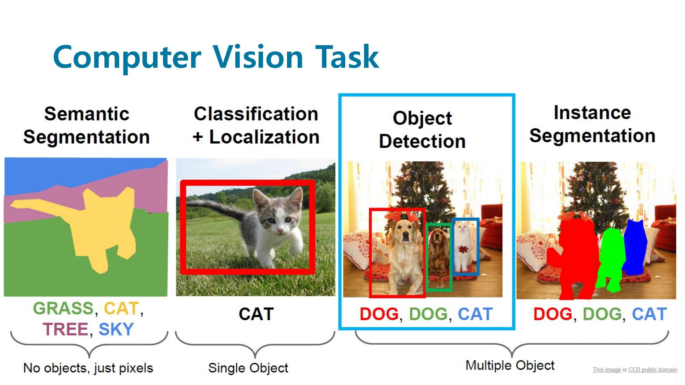

---

## Is Faster R-CNN Really Fast?

- Generally R-FCN and SSD models are faster on average while Faster R-CNN models are **more accurate**
- Faster R-CNN models can be faster if we limit the number of regions proposed

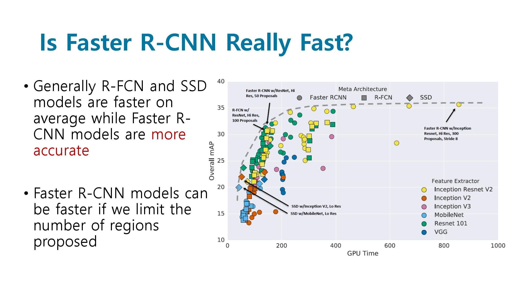

---

## R-CNN Architecture

**R-CNN: Regions with CNN features**

1. Input image
2. Extract region proposals (~2k)
3. Compute CNN features
4. Classify regions

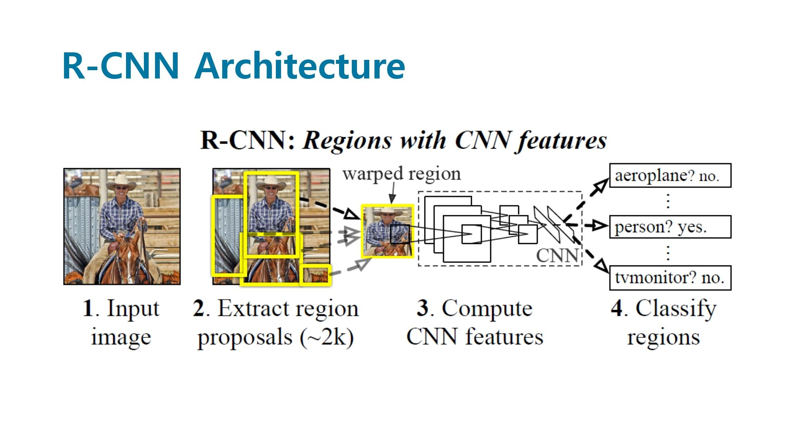

---

## R-CNN

Linear Regression for bounding box offsets

Classify regions with SVMs

Forward each region through ConvNet

Warped image regions

Regions of Interest (RoI) from a proposal method (~2k)

Input image

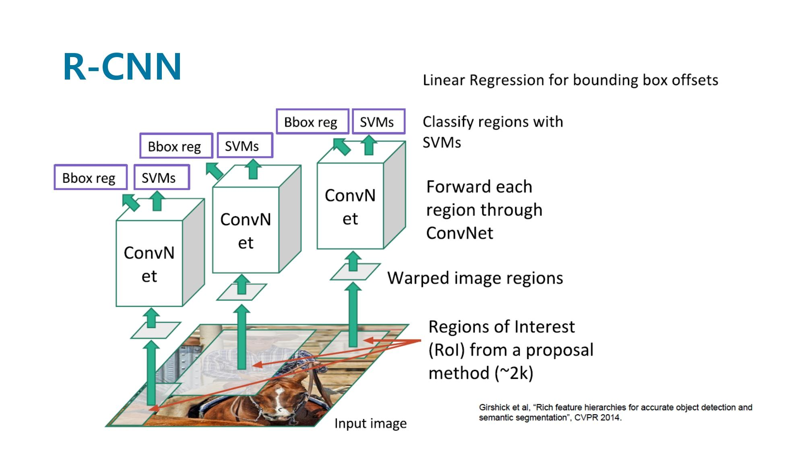

Girshick et al, "Rich feature hierarchies for accurate object detection and semantic segmentation", CVPR 2014.

---

## Region Proposals – Selective Search

- Bottom-up segmentation, merging regions at multiple scales

Convert regions to boxes

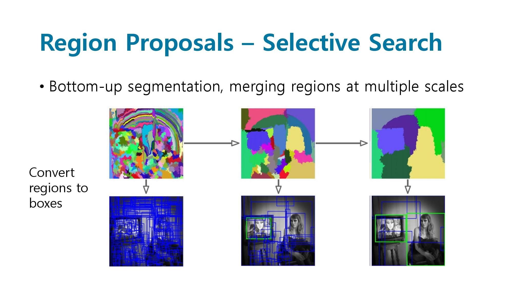

http://www.huppelen.nl/publications/selectiveSearchDraft.pdf

---

## Region Proposals – Selective Search

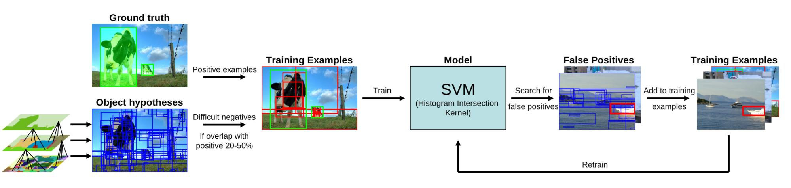

Considered as "difficult negatives". If overlap >= 50%, positive

Where the model confidently thinks it is the target, however, it is not …

|                        | Actual Positive                                     | Actual Negative                                     |
| ---------------------- | --------------------------------------------------- | --------------------------------------------------- |
| **Predicted Positive** | True positive (predicted positive Actual positive)  | False positive (predicted positive Actual negative) |
| **Predicted Negative** | False negative (predicted negative Actual positive) | True negative (predicted negative Actual negative)  |

http://www.huppelen.nl/publications/selectiveSearchDraft.pdf

---

## R-CNN Training

_"Post hoc" means the parameters are learned after the ConvNet is fixed_

- Pre-train a ConvNet(AlexNet) for ImageNet classification dataset
- Fine-tune for object detection(softmax + log loss)
- Cache feature vectors to disk
- Train post hoc linear SVMs(hinge loss)
- Train post hoc linear bounding-box regressors(squared loss)

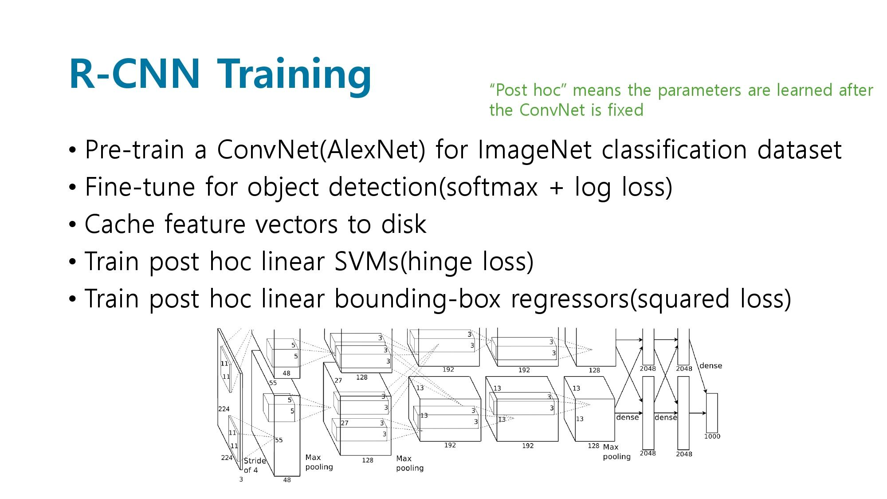

---

## Bounding-Box Regression

$P^i = (P^i_x, P^i_y, P^i_w, P^i_h)$ specifies the pixel coordinates of the center of proposal Pi's bounding box together with Pi's width and height in pixels

$G = (G_x, G_y, G_w, G_h)$ means the ground-truth bounding box

$$\hat{G}_x = P_w d_x(P) + P_x \quad (1)$$

$$\hat{G}_y = P_h d_y(P) + P_y \quad (2)$$

$$\hat{G}_w = P_w \exp(d_w(P)) \quad (3)$$

$$\hat{G}_h = P_h \exp(d_h(P)). \quad (4)$$

---

## Bounding-Box Regression

Each function $d_\star(P)$ (where $\star$ is one of $x, y, h, w$) is modeled as a linear function of the pool₅ features of proposal $P$, denoted by $\phi_5(P)$. (The dependence of $\phi_5(P)$ on the image data is implicitly assumed.) Thus we have $d_\star(P) = \mathbf{w}_\star^\mathrm{T} \phi_5(P)$, where $\mathbf{w}_\star$ is a vector of learnable model parameters. We learn $\mathbf{w}_\star$ by optimizing the regularized least squares objective (ridge regression):

$$\mathbf{w}_\star = \operatorname*{argmin}_{\hat{\mathbf{w}}_\star} \sum_i^N (t^i_\star - \hat{\mathbf{w}}_\star^\mathrm{T} \phi_5(P^i))^2 + \lambda \lVert \hat{\mathbf{w}}_\star \rVert^2 . \quad (5)$$

$$\hat{G}_x = P_w d_x(P) + P_x \quad (1)$$

$$\hat{G}_y = P_h d_y(P) + P_y \quad (2)$$

$$\hat{G}_w = P_w \exp(d_w(P)) \quad (3)$$

$$\hat{G}_h = P_h \exp(d_h(P)). \quad (4)$$

$$t_x = (G_x - P_x)/P_w \quad (6)$$

$$t_y = (G_y - P_y)/P_h \quad (7)$$

$$t_w = \log(G_w/P_w) \quad (8)$$

$$t_h = \log(G_h/P_h). \quad (9)$$

---

## Problems of R-CNN

- **Slow at test-time**: need to run full forward path of CNN for each region proposal
  - 13s/image on a GPU(K40)
  - 53s/image on a CPU
- **SVM and regressors are post-hoc**: CNN features not updated in response to SVMs and regressors
- **Complex multistage training pipeline** (84 hours using K40 GPU)
  - Fine-tune network with softmax classifier(log loss)
  - Train post-hoc linear SVMs(hinge loss)
  - Train post-hoc bounding-box regressions(squared loss)

---

## Fast R-CNN

- Fix most of what's wrong with R-CNN and SPP-net
- Train the detector in a **single stage, end-to-end**
  - No caching features to disk
  - No post hoc training steps
- Train **all layers** of the network

---

## Fast R-CNN Architecture

Deep ConvNet → Conv feature map

RoI projection → RoI pooling layer → FCs → RoI feature vector (For each RoI)

Outputs: softmax, bbox regressor

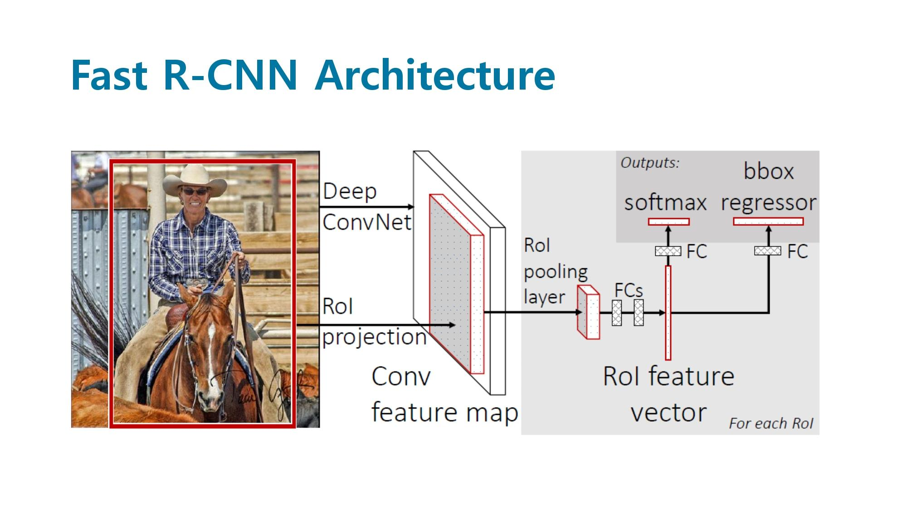

---

## Fast R-CNN

Softmax classifier (Linear + softmax)

Bounding-box regressors (Linear)

Fully-connected layers (FCs)

"RoI Pooling" layer

"conv5" feature map of image

Regions of Interest (RoIs) from a proposal method

Forward whole image through ConvNet

Input image

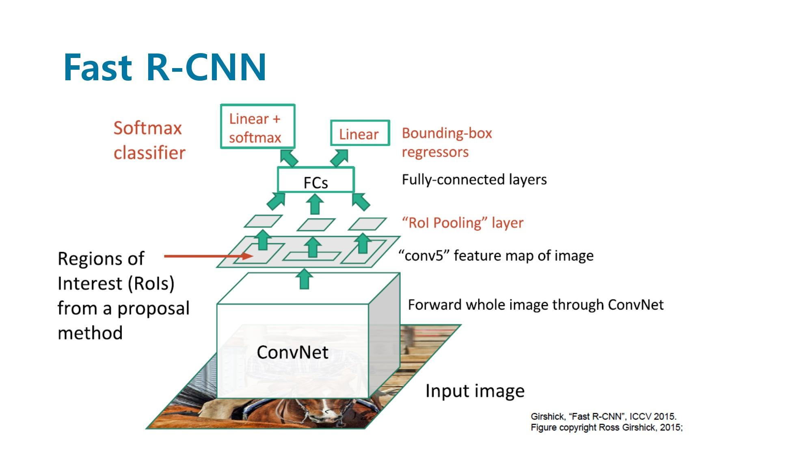

Girshick, "Fast R-CNN", ICCV 2015. Figure copyright Ross Girshick, 2015;

---

## RoI Pooling

Hi-res input image: 3 x 800 x 600 with region proposal

Convolution and Pooling

Hi-res conv features: C x H x W with region proposal

Max-pool within each grid cell

RoI conv features: C x h x w for region proposal

Fully-connected layers expect low-res conv features: C x h x w

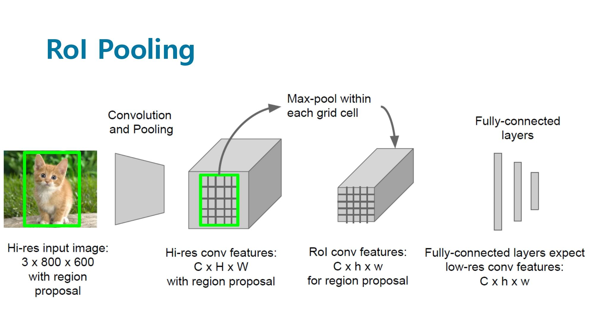

---

## RoI Pooling

Conv feature map → Region of Interest (RoI) → RoI pooling layer → fc layers …

VGG-16

Figure adapted from Kaiming He

Just a special case of the SPP layer with one pyramid level

RoI in Conv feature map : 21x14 → 3x2 max pooling with stride(3, 2) → output : 7x7

RoI in Conv feature map : 35x42 → 5x6 max pooling with stride(5, 6) → output : 7x7

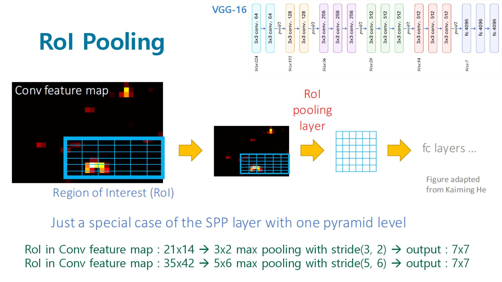

---

## Training & Testing

1. Takes an input and a set of bounding boxes
2. Generate convolutional feature maps
3. For each bbox, get a fixed-length feature vector from RoI pooling layer
4. Outputs have two information
   - K+1 class labels
   - Bounding box locations

- Loss function

$$L(p, u, t^u, v) = L_{\mathrm{cls}}(p, u) + \lambda [u \geq 1] L_{\mathrm{loc}}(t^u, v)$$

where $p$ = Predicted class scores, $u$ = True class scores, $t^u$ = Predicted box coordinates, $v$ = True box coordinates, $L_{\mathrm{cls}}$ = Log loss, $L_{\mathrm{loc}}$ = Smooth L1 loss

in which

$$L_{\mathrm{loc}}(t^u, v) = \sum_{i \in \{x,y,w,h\}} \mathrm{smooth}_{L_1}(t^u_i - v_i),$$

$$\mathrm{smooth}_{L_1}(x) = \begin{cases} 0.5x^2 & \text{if } |x| < 1 \\ |x| - 0.5 & \text{otherwise,} \end{cases}$$

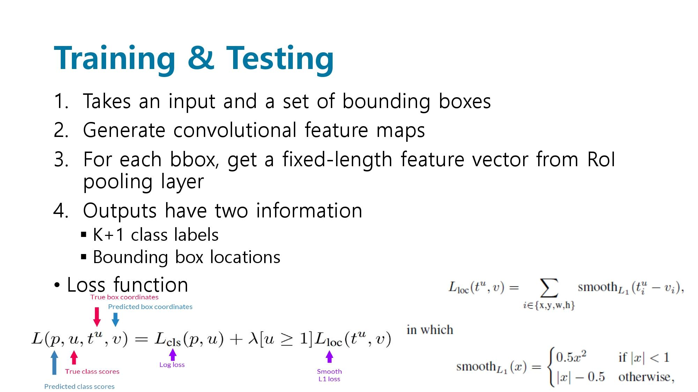

---

## R-CNN vs SPP-net vs Fast R-CNN

**Training time (Hours)**

| Model      | Hours |
| ---------- | ----- |
| R-CNN      | 84    |
| SPP-Net    | 25.5  |
| Fast R-CNN | 8.75  |

**Test time (seconds)**

| Model      | Including Region proposals | Excluding Region Proposals |
| ---------- | -------------------------- | -------------------------- |
| R-CNN      | 49                         | 47                         |
| SPP-Net    | 4.3                        | 2.3                        |
| Fast R-CNN | 2.3                        | 0.32                       |

**Runtime dominated by region proposals!**

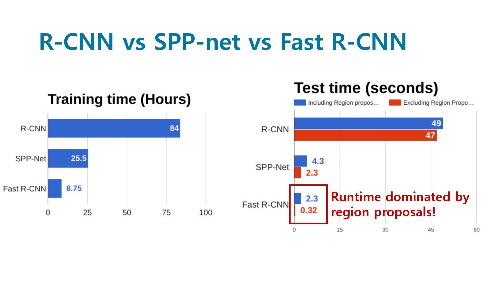

---

## Problems of Fast R-CNN

- Out-of-network region proposals are the test-time computational bottleneck
- Is it fast enough??

---

## Faster R-CNN(RPN + Fast R-CNN)

- Insert a Region Proposal Network (RPN) after the last convolutional layer → using GPU!
- RPN trained to produce region proposals directly; no need for external region proposals
- After RPN, use RoI Pooling and an upstream classifier and bbox regressor just like Fast R-CNN

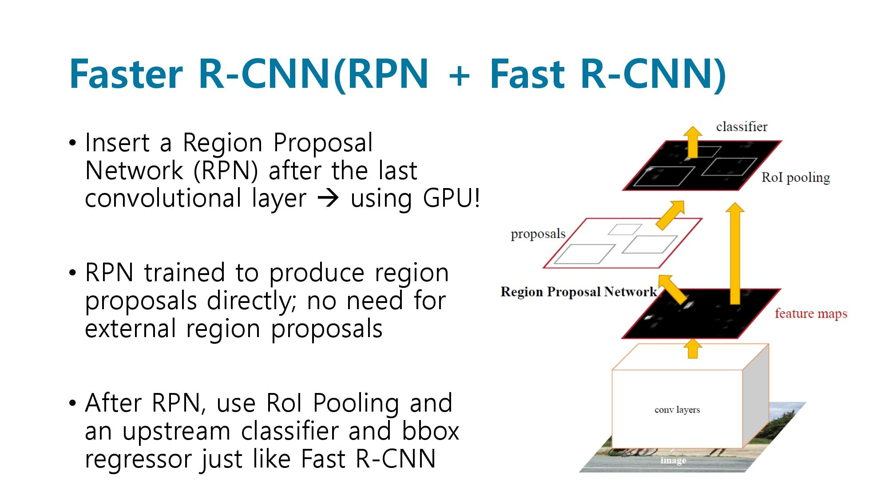

RPN = Region Proposal Network, it is a neural network now!

It is a small convolutional neural network

---

## Training Goal : Share Features

CNN A + RPN → RPN proposals

CNN B + detector → proposals from any algorithm → RoI pooling → classifier

Goal: share so CNN A == CNN B

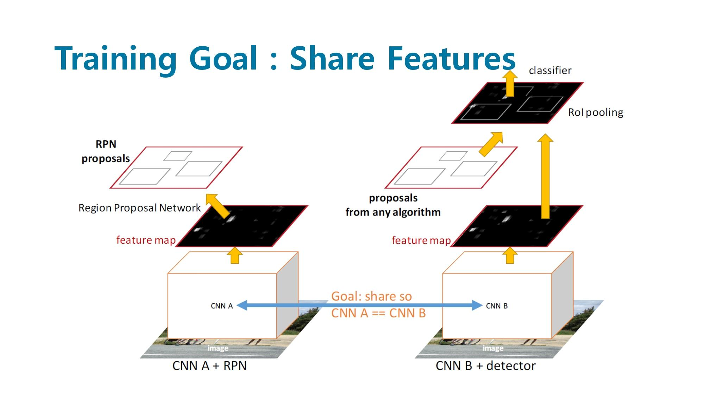

---

## RPN

- Slide a small window on the feature map
- Build a small network for
  - Classifying object or not-object
  - Regressing bbox locations
- Position of the sliding window provides localization information with reference to the image
- Box regression provides finer localization information with reference to this sliding window

classify obj./not-obj. → scores (1 x 1 conv)

regress box locations → coordinates (1 x 1 conv)

256-d (ZF : 256-d, VGG : 512-d), 3 x 3 conv, sliding window, convolutional feature map

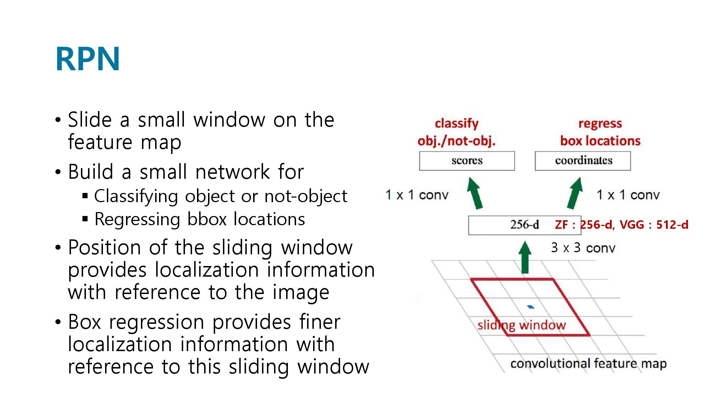

---

## RPN

- Use k anchor boxes at each location
- Anchors are translation invariant: use the same ones at every location
- Regression gives offsets from anchor boxes
- Classification gives the probability that each (regressed) anchor shows an object

Objectness scores → 2k scores (cls layer)

Bounding Box Regression → 4k coordinates (reg layer) ← k anchor boxes

256-d intermediate layer, sliding window, conv feature map

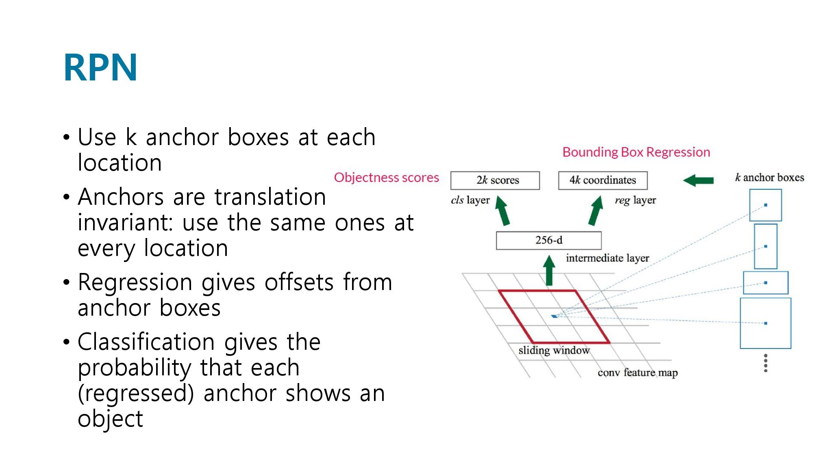

---

## RPN(Fully Convolutional Network)

- Intermediate Layer – 256(or 512) 3x3 filter, stride 1, padding 1
- Cls layer – 18(9x2) 1x1 filter, stride 1, padding 0
- Reg layer – 36(9x4) 1x1 filter, stride 1, padding 0

classify obj./not-obj. → scores (1 x 1 conv)

regress box locations → coordinates (1 x 1 conv)

256-d (ZF : 256-d, VGG : 512-d), 3 x 3 conv, sliding window, convolutional feature map

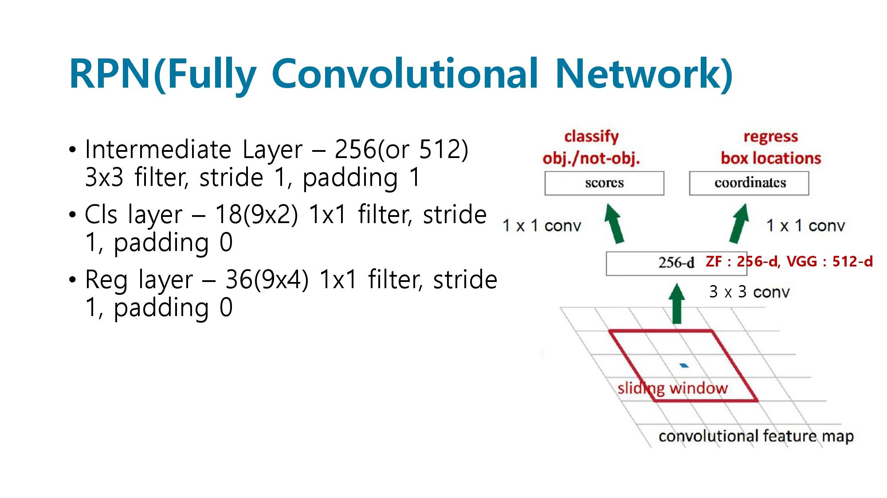

---

## Anchors as references

- **Anchors**: pre-defined reference boxes
- **Multi-scale/size** anchors:
  - Multiple anchors are used at each position:
    - 3 scale(128x128, 256x256, 512x512) and 3 aspect rations(2:1, 1:1, 1:2) yield 9 anchors
  - Each anchor has its own prediction function
  - **Single-scale** features, **multi-scale** predictions

---

## Positive/Negative Samples

- An anchor is **labeled as positive** if
  - The anchor is the one with **highest IoU** overlap with a ground-truth box
  - The anchor has an IoU overlap with a ground-truth box **higher than 0.7**
- **Negative labels** are assigned to anchors with **IoU lower than 0.3** for all ground-truth boxes
- 50%/50% ratio of positive/negative anchors in a minibatch

---

## RPN Loss Function

_i_ = anchor index in minibatch

$$L(\{p_i\}, \{t_i\}) = \frac{1}{N_{cls}} \sum_i L_{cls}(p_i, p_i^*) + \lambda \frac{1}{N_{reg}} \sum_i p_i^* L_{reg}(t_i, t_i^*).$$

- $p_i$ = Predicted probability of being an object for anchor _i_
- $t_i$ = Coordinates of the predicted bounding box for anchor _i_
- $L_{cls}$ = Log loss
- $p_i^*$ = Ground truth objectness label
- $L_{reg}$ = Smooth L1 loss
- $t_i^*$ = True box coordinates
- In practice λ = 10, so that both terms are roughly equally balanced

Ncls = Number of anchors in minibatch (~ 256)

Nreg = Number of anchor locations ( ~ 2400)

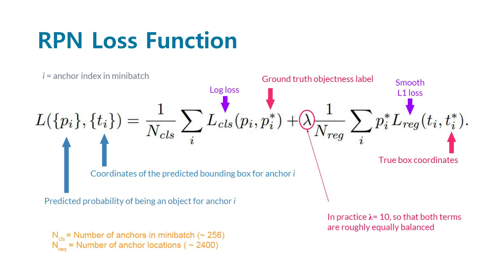

---

## Is It Enough?

- RoI Pooling has some quantization operations
- These quantizations introduce misalignments between the RoI and the extracted features
- While this may not impact classification, it can make a negative effect on predicting bbox

---

## Mask R-CNN

RoIAlign → conv → conv → class box, mask

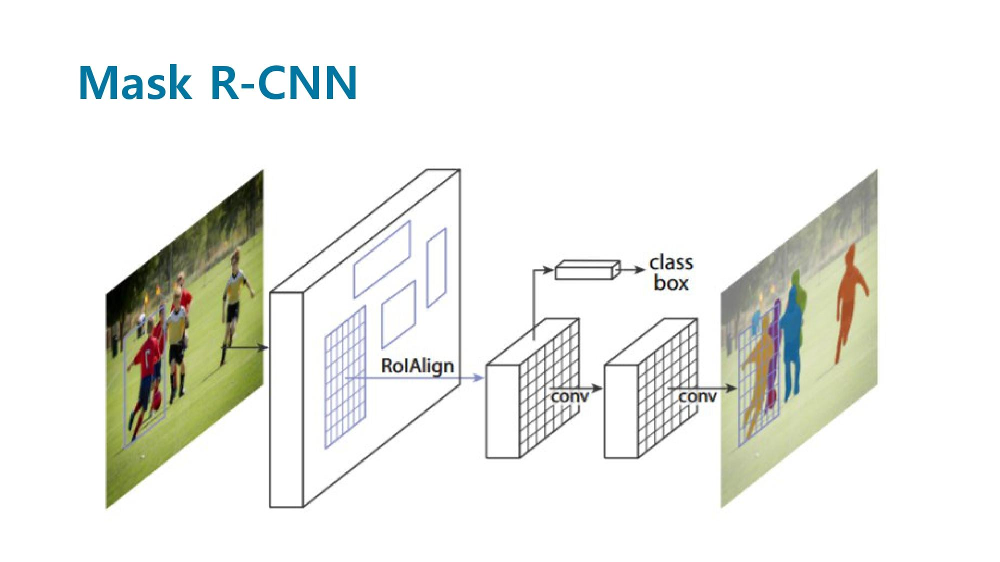

---

## Mask R-CNN

- Mask R-CNN extends Faster R-CNN by adding a branch for predicting segmentation masks on each Region of Interest (RoI), in parallel with the existing branch for classification and bounding box regression

Faster R-CNN w/ ResNet [19]: RoI → 7×7 ×1024 → res5 → 7×7 ×2048 → ave → 2048 → class, box; 14×14 ×256 → 14×14 ×80 → mask

Faster R-CNN w/ FPN [27]: RoI → 7×7 ×256 → 1024 → 1024 → class, box; RoI → 14×14 ×256 → ×4 → 14×14 ×256 → 28×28 ×256 → 28×28 ×80 → mask

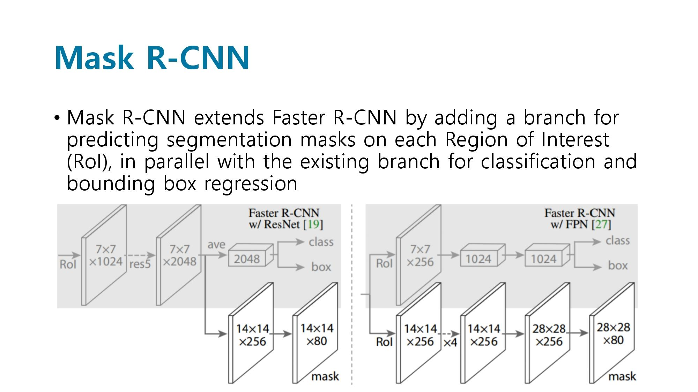

---

## Loss Function, Mask Branch

$$L = L_{cls} + L_{box} + L_{mask}$$

- The mask branch has a K x m x m - dimensional output for each RoI, which encodes K binary masks of resolution m × m, one for each of the K classes.
- Applying per-pixel sigmoid
- For an RoI associated with ground-truth class k, Lmask is only defined on the k-th mask

---

## RoI Align

- RoI Align don't use quantization of the RoI boundaries
- Bilinear interpolation is used for computing the exact values of the input features

---

## Results – MS COCO

|                            | backbone                 | APbb | APbb50 | APbb75 | APbbS | APbbM | APbbL |
| -------------------------- | ------------------------ | --------------- | ---------------------------- | ---------------------------- | --------------------------- | --------------------------- | --------------------------- |
| Faster R-CNN+++ [19]       | ResNet-101-C4            | 34.9            | 55.7                         | 37.4                         | 15.6                        | 38.7                        | 50.9                        |
| Faster R-CNN w FPN [27]    | ResNet-101-FPN           | 36.2            | 59.1                         | 39.0                         | 18.2                        | 39.0                        | 48.2                        |
| Faster R-CNN by G-RMI [21] | Inception-ResNet-v2 [37] | 34.7            | 55.5                         | 36.7                         | 13.5                        | 38.1                        | 52.0                        |
| Faster R-CNN w TDM [36]    | Inception-ResNet-v2-TDM  | 36.8            | 57.7                         | 39.2                         | 16.2                        | 39.8                        | **52.1**                    |
| Faster R-CNN, RoIAlign     | ResNet-101-FPN           | 37.3            | 59.6                         | 40.3                         | 19.8                        | 40.2                        | 48.8                        |
| **Mask R-CNN**             | ResNet-101-FPN           | 38.2            | 60.3                         | 41.7                         | 20.1                        | 41.1                        | 50.2                        |
| **Mask R-CNN**             | ResNeXt-101-FPN          | **39.8**        | **62.3**                     | **43.4**                     | **22.1**                    | **43.2**                    | 51.2                        |

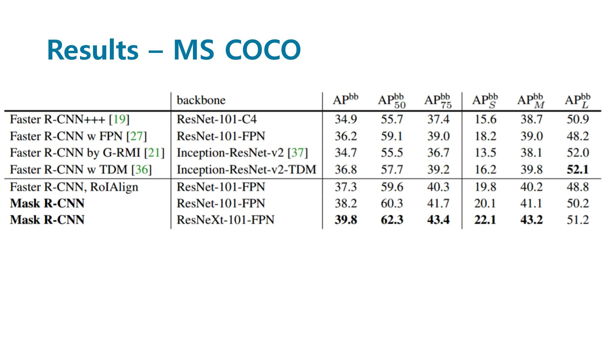

---

## You Only Look Once (YOLO): Unified Real-Time Object Detection

Convolutional! Convolutional!

---

## YOLO : Object Detection as Regression Problem

Output: Bounding box coordinates and Class Probabilities

- Single, One-stage Neural Network
- Benefits:
  - Extremely Fast (one NN + 45 frames per sec), twice more mAP.
  - Global Reasoning (knows context, less background errors)
  - Generalizable Representations (train natural images, test art-work, applicable new domain)

1. Resize image.
2. Run convolutional network.
3. Non-max suppression.

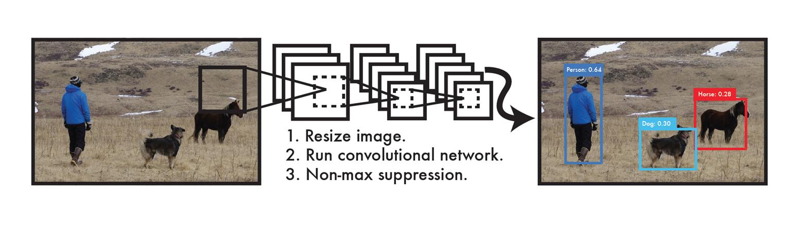

---

## YOLO : Object Detection as Regression Problem

Limitations:

1. Less accurate for small objects;
2. Lower recall when compared to R-CNN family;
3. Tradeoff between speed and accuracy.

---

## YOLO family…

- Faster, stronger performance on small objects, optimized for edge devices, attention-based (instead of solely on CNN)…

---

## YOLOv12: Attention-Centric Real-Time Object Detectors

- https://arxiv.org/pdf/2502.12524

**YOLOv12: Attention-Centric Real-Time Object Detectors**

Yunjie Tian, University at Buffalo, yunjieti@buffalo.edu

Qixiang Ye, University of Chinese Academy of Sciences, qxye@ucas.ac.cn

David Doermann, University at Buffalo, doermann@buffalo.edu

github.com/sunsmarterjie/yolov12

-- Technical Report --

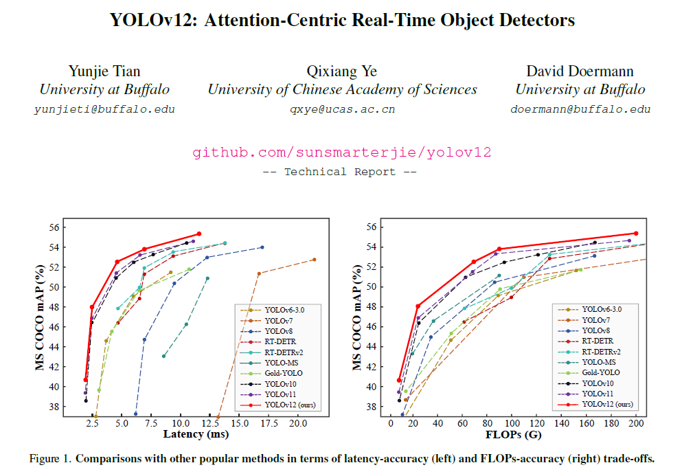

Figure 1. Comparisons with other popular methods in terms of latency-accuracy (left) and FLOPs-accuracy (right) trade-offs.

---

| Method               | FLOPs (G) | #Param. (M) | APval50:95 (%) | APval50 (%) | APval75 (%) | Latency (ms) |
| -------------------- | --------- | ----------- | ------------------------------------ | --------------------------------- | --------------------------------- | ------------ |
| YOLOv6-3.0-N [32]    | 11.4      | 4.7         | 37.0                                 | 52.7                              | –                                 | 2.69         |
| Gold-YOLO-N [54]     | 12.1      | 5.6         | 39.6                                 | 55.7                              | –                                 | 2.92         |
| YOLOv8-N [24]        | 8.7       | 3.2         | 37.4                                 | 52.6                              | 40.5                              | 1.77         |
| YOLOv10-N [53]       | 6.7       | 2.3         | 38.5                                 | 53.8                              | 41.7                              | 1.84         |
| YOLO11-N [28]        | 6.5       | 2.6         | 39.4                                 | 55.3                              | 42.8                              | 1.5          |
| **YOLOv12-N (Ours)** | **6.5**   | **2.6**     | **40.6**                             | **56.7**                          | **43.8**                          | **1.64**     |
| YOLOv6-3.0-S [32]    | 45.3      | 18.5        | 44.3                                 | 61.2                              | –                                 | 3.42         |
| Gold-YOLO-S [54]     | 46.0      | 21.5        | 45.4                                 | 62.5                              | –                                 | 3.82         |
| YOLOv8-S [24]        | 28.6      | 11.2        | 45.0                                 | 61.8                              | 48.7                              | 2.33         |
| RT-DETR-R18 [66]     | 60.0      | 20.0        | 46.5                                 | 63.8                              | –                                 | 4.58         |
| RT-DETRv2-R18 [41]   | 60.0      | 20.0        | 47.9                                 | 64.9                              | –                                 | 4.58         |
| YOLOv9-S [58]        | 26.4      | 7.1         | 46.8                                 | 63.4                              | 50.7                              | –            |
| YOLOv10-S [53]       | 21.6      | 7.2         | 46.3                                 | 63.0                              | 50.4                              | 2.49         |
| YOLO11-S [28]        | 21.5      | 9.4         | 46.9                                 | 63.9                              | 50.6                              | 2.5          |
| **YOLOv12-S (Ours)** | **21.4**  | **9.3**     | **48.0**                             | **65.0**                          | **51.8**                          | **2.61**     |
| YOLOv6-3.0-M [32]    | 85.8      | 34.9        | 49.1                                 | 66.1                              | –                                 | 5.63         |
| Gold-YOLO-M [54]     | 87.5      | 41.3        | 49.8                                 | 67.0                              | –                                 | 6.38         |
| YOLOv8-M [24]        | 78.9      | 25.9        | 50.3                                 | 67.2                              | 54.7                              | 5.09         |
| RT-DETR-R34 [66]     | 100.0     | 36.0        | 48.9                                 | 66.8                              | –                                 | 6.32         |
| RT-DETRv2-R34 [41]   | 100.0     | 36.0        | 49.9                                 | 67.5                              | –                                 | 6.32         |
| YOLOv9-M [58]        | 76.3      | 20.0        | 51.4                                 | 68.1                              | 56.1                              | –            |
| YOLOv10-M [53]       | 59.1      | 15.4        | 51.1                                 | 68.1                              | 55.8                              | 4.74         |
| YOLO11-M [28]        | 68.0      | 20.1        | 51.5                                 | 68.5                              | 55.7                              | 4.7          |
| **YOLOv12-M (Ours)** | **67.5**  | **20.2**    | **52.5**                             | **69.6**                          | **57.1**                          | **4.86**     |
| YOLOv6-3.0-L [32]    | 150.7     | 59.6        | 51.8                                 | 69.2                              | –                                 | 9.02         |
| Gold-YOLO-L [54]     | 151.7     | 75.1        | 51.8                                 | 68.9                              | –                                 | 10.65        |
| YOLOv8-L [24]        | 165.2     | 43.7        | 53.0                                 | 69.8                              | 57.7                              | 8.06         |
| RT-DETR-R50 [66]     | 136.0     | 42.0        | 53.1                                 | 71.3                              | –                                 | 6.90         |
| RT-DETRv2-R50 [41]   | 136.0     | 42.0        | 53.4                                 | 71.6                              | –                                 | 6.90         |
| YOLOv9-C [58]        | 102.1     | 25.3        | 53.0                                 | 70.2                              | 57.8                              | –            |
| YOLOv10-B [53]       | 92.0      | 19.1        | 52.5                                 | 69.6                              | 57.2                              | 5.74         |
| YOLOv10-L [53]       | 120.3     | 24.4        | 53.2                                 | 70.1                              | 58.1                              | 7.28         |
| YOLO11-L [28]        | 86.9      | 25.3        | 53.3                                 | 70.1                              | 58.2                              | 6.2          |
| **YOLOv12-L (Ours)** | **88.9**  | **26.4**    | **53.7**                             | **70.7**                          | **58.5**                          | **6.77**     |
| YOLOv8-X [24]        | 257.8     | 68.2        | 54.0                                 | 71.0                              | 58.8                              | 12.83        |
| RT-DETR-R101 [66]    | 259.0     | 76.0        | 54.3                                 | 72.7                              | –                                 | 13.5         |
| RT-DETRv2-R101 [41]  | 259.0     | 76.0        | 54.3                                 | 72.8                              | –                                 | 13.5         |
| YOLOv10-X [53]       | 160.4     | 29.5        | 54.4                                 | 71.3                              | 59.3                              | 10.70        |
| YOLO11-X [28]        | 194.9     | 56.9        | 54.6                                 | 71.6                              | 59.5                              | 11.3         |
| **YOLOv12-X (Ours)** | **199.0** | **59.1**    | **55.2**                             | **72.0**                          | **60.2**                          | **11.79**    |

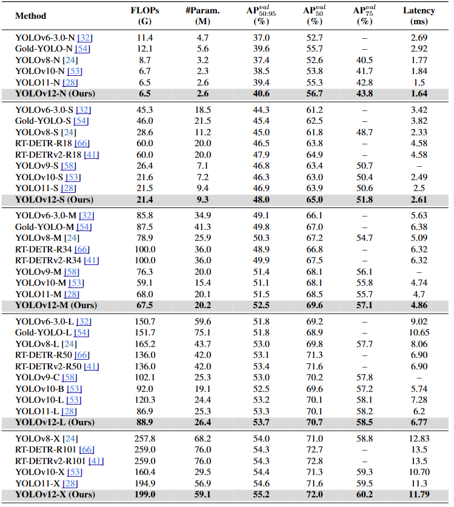

---

## Results from YOLO

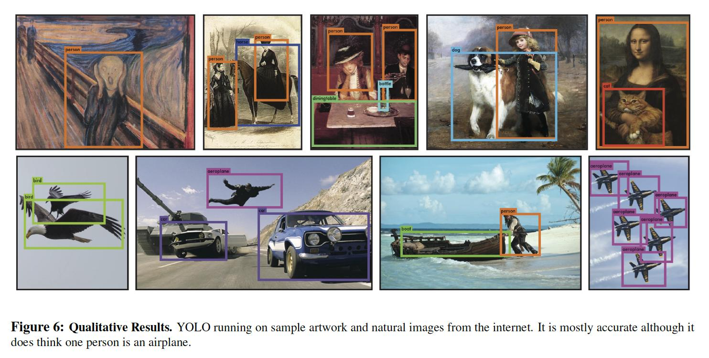

**Figure 6: Qualitative Results.** YOLO running on sample artwork and natural images from the internet. It is mostly accurate although it does think one person is an airplane.
